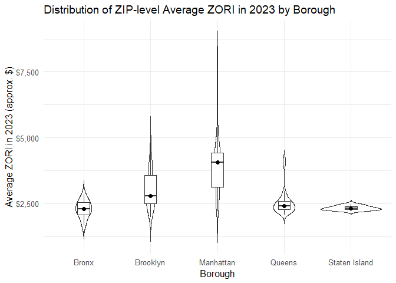

p8105_hw3_dj2764
================
Daniel Jiao

## load library

``` r
library(tidyverse)
library(lubridate)
library(janitor)
library(scales)
library(knitr)
```

# Problem 1

## load & check dataset

``` r
library(p8105.datasets)
data("instacart")

glimpse(instacart)
```

    ## Rows: 1,384,617
    ## Columns: 15
    ## $ order_id               <int> 1, 1, 1, 1, 1, 1, 1, 1, 36, 36, 36, 36, 36, 36,…
    ## $ product_id             <int> 49302, 11109, 10246, 49683, 43633, 13176, 47209…
    ## $ add_to_cart_order      <int> 1, 2, 3, 4, 5, 6, 7, 8, 1, 2, 3, 4, 5, 6, 7, 8,…
    ## $ reordered              <int> 1, 1, 0, 0, 1, 0, 0, 1, 0, 1, 0, 1, 1, 1, 1, 1,…
    ## $ user_id                <int> 112108, 112108, 112108, 112108, 112108, 112108,…
    ## $ eval_set               <chr> "train", "train", "train", "train", "train", "t…
    ## $ order_number           <int> 4, 4, 4, 4, 4, 4, 4, 4, 23, 23, 23, 23, 23, 23,…
    ## $ order_dow              <int> 4, 4, 4, 4, 4, 4, 4, 4, 6, 6, 6, 6, 6, 6, 6, 6,…
    ## $ order_hour_of_day      <int> 10, 10, 10, 10, 10, 10, 10, 10, 18, 18, 18, 18,…
    ## $ days_since_prior_order <int> 9, 9, 9, 9, 9, 9, 9, 9, 30, 30, 30, 30, 30, 30,…
    ## $ product_name           <chr> "Bulgarian Yogurt", "Organic 4% Milk Fat Whole …
    ## $ aisle_id               <int> 120, 108, 83, 83, 95, 24, 24, 21, 2, 115, 53, 1…
    ## $ department_id          <int> 16, 16, 4, 4, 15, 4, 4, 16, 16, 7, 16, 4, 16, 2…
    ## $ aisle                  <chr> "yogurt", "other creams cheeses", "fresh vegeta…
    ## $ department             <chr> "dairy eggs", "dairy eggs", "produce", "produce…

## describe the dataset

``` r
n_obs <- nrow(instacart)
n_users <- n_distinct(instacart$user_id)
n_vars <- ncol(instacart)
```

The dataset contains 1384617 observations from 131209 unique users and
includes 15 variables. Each row corresponds to a single product
purchased within an order, with key variables such as order_id, user_id,
product_name, aisle, and order_hour_of_day.

## a) How many aisles are there, and which aisles are the most items ordered from?

``` r
n_aisles <- instacart %>% summarise(n = n_distinct(aisle)) %>% pull(n)
top_aisles <- instacart %>% count(aisle, sort = TRUE) %>% slice_head(n = 3)
```

There are 134 distinct values of aisle in the dataset. The three aisles
with the highest counts are:

fresh vegetables with 150609 orders

fresh fruits with 150473 orders

packaged vegetables fruits with 78493 orders

## b) Make a plot that shows the number of items ordered in each aisle, limiting this to aisles with more than 10000 items ordered.

``` r
instacart %>% 
  count(aisle) %>% 
  filter(n > 10000) %>% 
  ggplot(aes(x = reorder(aisle, n), y = n)) +
  geom_col(fill = "steelblue") +
  coord_flip() +
  labs(
    title = "Number of Items Ordered per Aisle (>10,000 orders)",
    x = "Aisle",
    y = "Number of Items Ordered"
  ) +
  theme_minimal()
```

<!-- -->

The bar plot shows which aisles are most frequently ordered from. fresh
vegetables, fresh fruits, and packaged vegetables fruits stand out
significantly, confirming that fresh produce and packaged vegetables are
the most popular categories.

## c) Make a table showing the three most popular items in each of the aisles “baking ingredients”, “dog food care”, and “packaged vegetables fruits”.

``` r
instacart %>% 
  filter(aisle %in% c("baking ingredients", "dog food care", "packaged vegetables fruits")) %>% 
  count(aisle, product_name, sort = TRUE) %>% 
  group_by(aisle) %>% 
  slice_max(n, n = 3) %>% 
  knitr::kable(caption = "Top 3 Most Popular Items per Selected Aisle")
```

| aisle                      | product_name                                  |    n |
|:---------------------------|:----------------------------------------------|-----:|
| baking ingredients         | Light Brown Sugar                             |  499 |
| baking ingredients         | Pure Baking Soda                              |  387 |
| baking ingredients         | Cane Sugar                                    |  336 |
| dog food care              | Snack Sticks Chicken & Rice Recipe Dog Treats |   30 |
| dog food care              | Organix Chicken & Brown Rice Recipe           |   28 |
| dog food care              | Small Dog Biscuits                            |   26 |
| packaged vegetables fruits | Organic Baby Spinach                          | 9784 |
| packaged vegetables fruits | Organic Raspberries                           | 5546 |
| packaged vegetables fruits | Organic Blueberries                           | 4966 |

Top 3 Most Popular Items per Selected Aisle

## d) Make a table showing the mean hour of the day at which Pink Lady Apples and Coffee Ice Cream are ordered on each day of the week

``` r
instacart %>%
  filter(product_name %in% c("Pink Lady Apples", "Coffee Ice Cream")) %>%
  group_by(product_name, order_dow) %>%
  summarise(mean_hour = mean(order_hour_of_day)) %>%
  pivot_wider(names_from = order_dow, values_from = mean_hour) %>%
  knitr::kable(
    caption = "Mean Hour of Order by Day of Week",
    col.names = c("Product", "Sun", "Mon", "Tue", "Wed", "Thu", "Fri", "Sat")
  )
```

    ## `summarise()` has grouped output by 'product_name'. You can override using the
    ## `.groups` argument.

| Product          |      Sun |      Mon |      Tue |      Wed |      Thu |      Fri |      Sat |
|:-----------------|---------:|---------:|---------:|---------:|---------:|---------:|---------:|
| Coffee Ice Cream | 13.77419 | 14.31579 | 15.38095 | 15.31818 | 15.21739 | 12.26316 | 13.83333 |
| Pink Lady Apples | 13.44118 | 11.36000 | 11.70213 | 14.25000 | 11.55172 | 12.78431 | 11.93750 |

Mean Hour of Order by Day of Week

# Problem 2

``` r
zori_raw <- readr::read_csv("./data/Zip_zori_uc_sfrcondomfr_sm_month_NYC.csv")
```

    ## Rows: 149 Columns: 125
    ## ── Column specification ────────────────────────────────────────────────────────
    ## Delimiter: ","
    ## chr   (6): RegionType, StateName, State, City, Metro, CountyName
    ## dbl (119): RegionID, SizeRank, RegionName, 2015-01-31, 2015-02-28, 2015-03-3...
    ## 
    ## ℹ Use `spec()` to retrieve the full column specification for this data.
    ## ℹ Specify the column types or set `show_col_types = FALSE` to quiet this message.

``` r
zipmap_raw <- readr::read_csv("./data/Zip COdes.csv") %>% clean_names()
```

    ## Rows: 322 Columns: 7
    ## ── Column specification ────────────────────────────────────────────────────────
    ## Delimiter: ","
    ## chr (4): County, County Code, File Date, Neighborhood
    ## dbl (3): State FIPS, County FIPS, ZipCode
    ## 
    ## ℹ Use `spec()` to retrieve the full column specification for this data.
    ## ℹ Specify the column types or set `show_col_types = FALSE` to quiet this message.

``` r
# 5 boroughs' county names
nyc_counties <- c("Bronx", "Kings", "New York", "Queens", "Richmond")  

# standardize ZIP 
std_zip <- function(x) stringr::str_pad(as.character(x), width = 5, side = "left", pad = "0")
date_cols <- names(zori_raw)[grepl("^\\d{4}-\\d{2}-\\d{2}$", names(zori_raw))]

# Zillow dataset
zori_nyc_long <- zori_raw %>%
  rename(zip = RegionName,
         county = CountyName,
         state = State) %>%
  mutate(zip = std_zip(zip),
          county = str_trim(str_remove(county, "\\s*County$")))%>%
# Long format
  pivot_longer(
    cols = all_of(date_cols),
    names_to  = "date_str",
    values_to = "zori"
  ) %>%
  mutate(
    # Change to beginning of the month
    date = floor_date(as.Date(date_str), "month"),
    borough = case_when(
      county == "Bronx"    ~ "Bronx",
      county == "Kings"    ~ "Brooklyn",
      county == "New York" ~ "Manhattan",
      county == "Queens"   ~ "Queens",
      county == "Richmond" ~ "Staten Island",
      TRUE ~ NA_character_
    )
  ) %>%

  
  filter(state %in% c("NY", "New York"), county %in% nyc_counties) %>%
  select(zip, borough, county, any_of(c("City","Metro")), date, zori) %>%
  arrange(zip, date)

# Take out useless variables
zori_nyc_long <- zori_nyc_long %>% select(-any_of(c("Metro","metro")),- county,- City)


zipmap <- zipmap_raw %>%
  mutate(
    zip = std_zip(zip_code),
    # take out 'county'
    county  = str_remove(str_to_title(county), "\\s*County$"),
    borough = recode(county,
      "Bronx"    = "Bronx",
      "Kings"    = "Brooklyn",
      "New York" = "Manhattan",
      "Queens"   = "Queens",
      "Richmond" = "Staten Island",
      .default   = NA_character_
    )
  ) %>%
  select(zip, borough, neighborhood) %>%
  distinct()


zori_nyc <- zori_nyc_long %>%
  left_join(zipmap, by = c("zip","borough")) %>%
  relocate(zip, borough, neighborhood, date, zori) %>%
  filter(!is.na(zori))

zori_nyc
```

    ## # A tibble: 10,450 × 5
    ##    zip   borough   neighborhood        date        zori
    ##    <chr> <chr>     <chr>               <date>     <dbl>
    ##  1 10001 Manhattan Chelsea and Clinton 2015-01-01 3855.
    ##  2 10001 Manhattan Chelsea and Clinton 2015-02-01 3892.
    ##  3 10001 Manhattan Chelsea and Clinton 2015-03-01 3898.
    ##  4 10001 Manhattan Chelsea and Clinton 2015-04-01 3970.
    ##  5 10001 Manhattan Chelsea and Clinton 2015-05-01 4033.
    ##  6 10001 Manhattan Chelsea and Clinton 2015-06-01 4071.
    ##  7 10001 Manhattan Chelsea and Clinton 2015-07-01 4067.
    ##  8 10001 Manhattan Chelsea and Clinton 2015-08-01 4070.
    ##  9 10001 Manhattan Chelsea and Clinton 2015-09-01 4040.
    ## 10 10001 Manhattan Chelsea and Clinton 2015-10-01 4023.
    ## # ℹ 10,440 more rows

``` r
# Define the target 116-month window explicitly
target_months <- seq(as.Date("2015-01-01"), as.Date("2024-08-01"), by = "month")
n_target_months <- length(target_months)  # should be 116

# Count how many months each ZIP appears in this window
zip_month_counts <- zori_nyc %>%
  filter(date %in% target_months) %>%
  count(zip, name = "n_months")

# Counts of interest
n_zip_116  <- sum(zip_month_counts$n_months == n_target_months)
n_zip_lt10 <- sum(zip_month_counts$n_months < 10)

# (Optional) example ZIPs to reference inline if needed
example_full_zip   <- zip_month_counts %>% filter(n_months == n_target_months) %>% slice_head(n = 1) %>% pull(zip)
example_sparse_zip <- zip_month_counts %>% arrange(n_months) %>% slice_head(n = 1) %>% pull(zip)
```

From 2015-01 to 2024-08 there are 116 months.

ZIPs observed in all 116 months: 48.

ZIPs observed fewer than 10 times: 26.

ZIPs that are rarely observed typically correspond to non-residential or
PO-Box-heavy ZIPs, new/retired ZIPs or places with insufficient listing
volume for a stable ZORI; ZIPs with complete coverage tend to be stable
residential areas with adequate rental inventory.

``` r
borough_year_tbl <- zori_nyc %>%
  mutate(year = year(date)) %>%
  group_by(borough, year) %>%
  summarise(avg_rent = mean(zori, na.rm = TRUE), .groups = "drop") %>%
  arrange(borough, year)

# Pretty table wide-format with $ formatting
borough_year_tbl %>%
  mutate(avg_rent = dollar(avg_rent)) %>%
  tidyr::pivot_wider(names_from = year, values_from = avg_rent) %>%
  kable(caption = "Average ZORI by Borough and Year (NYC)")
```

| borough       | 2015       | 2016       | 2017       | 2018       | 2019       | 2020       | 2021       | 2022       | 2023       | 2024       |
|:--------------|:-----------|:-----------|:-----------|:-----------|:-----------|:-----------|:-----------|:-----------|:-----------|:-----------|
| Bronx         | \$1,759.60 | \$1,520.19 | \$1,543.60 | \$1,639.43 | \$1,705.59 | \$1,811.44 | \$1,857.78 | \$2,054.27 | \$2,285.46 | \$2,496.90 |
| Brooklyn      | \$2,492.93 | \$2,520.36 | \$2,545.83 | \$2,547.29 | \$2,630.50 | \$2,555.05 | \$2,549.89 | \$2,868.20 | \$3,015.18 | \$3,126.80 |
| Manhattan     | \$3,022.04 | \$3,038.82 | \$3,133.85 | \$3,183.70 | \$3,310.41 | \$3,106.52 | \$3,136.63 | \$3,778.37 | \$3,932.61 | \$4,078.44 |
| Queens        | \$2,214.71 | \$2,271.96 | \$2,263.30 | \$2,291.92 | \$2,387.82 | \$2,315.63 | \$2,210.79 | \$2,406.04 | \$2,561.62 | \$2,694.02 |
| Staten Island | NA         | NA         | NA         | NA         | NA         | \$1,977.61 | \$2,045.43 | \$2,147.44 | \$2,332.93 | \$2,536.44 |

Average ZORI by Borough and Year (NYC)

Across the observed years, the largest net increase (first→last
available year) occurs in Manhattan. A pandemic dip is visible around
2020–2021, especially for Manhattan, followed by a rebound into
2022–2024. Outer-boroughs such as Brooklyn and Queens show steadier
growth, while Manhattan exhibits bigger swings.

``` r
# Borough monthly medians for a clean overlay
borough_month_median <- zori_nyc %>%
  group_by(borough, date) %>%
  summarise(zori_med = median(zori, na.rm = TRUE), .groups = "drop")

p_zip_lines <- zori_nyc %>%
  ggplot(aes(x = date, y = zori, group = zip)) +
  geom_line(alpha = 0.12) +  # many thin ZIP lines
  geom_line(data = borough_month_median,
            aes(y = zori_med, group = borough),
            linewidth = 1) +  # bold borough median
  facet_wrap(~ borough, ncol = 2, scales = "free_y") +
  scale_y_continuous(labels = dollar) +
  labs(
    title = "NYC ZIP-level ZORI (thin) with Borough Monthly Median (bold)",
    x = "Year", y = "ZORI (approx. $)"
  ) +
  theme_minimal(base_size = 12)

p_zip_lines
```

<!-- -->

``` r
zip_2023_avg <- zori_nyc %>%
  filter(lubridate::year(date) == 2023) %>%
  group_by(zip, borough) %>%
  summarise(avg_2023 = mean(zori, na.rm = TRUE), .groups = "drop")

p_2023_dist <- zip_2023_avg %>%
  ggplot(aes(x = borough, y = avg_2023)) +
  geom_violin(trim = FALSE, alpha = 0.2) +
  geom_boxplot(width = 0.18, outlier.shape = NA) +
  stat_summary(fun = median, geom = "point", size = 2) +
  scale_y_continuous(labels = dollar) +
  labs(
    title = "Distribution of ZIP-level Average ZORI in 2023 by Borough",
    x = "Borough", y = "Average ZORI in 2023 (approx. $)"
  ) +
  theme_minimal(base_size = 12)

p_2023_dist
```

<!-- -->

``` r
dir.create("results", showWarnings = FALSE)

# Save individual panels
ggsave("results/zillow_zip_trajectories.png", p_zip_lines, width = 10, height = 8, dpi = 300)
ggsave("results/zillow_2023_distributions.png", p_2023_dist, width = 10, height = 5, dpi = 300)

# Try combining without installing anything new
combined_path <- "results/zillow_combined.png"

if (requireNamespace("patchwork", quietly = TRUE)) {
  combined_plot <- patchwork::wrap_plots(
    p_zip_lines, p_2023_dist, ncol = 1, heights = c(2, 1)
  ) + patchwork::plot_annotation(
    title = "NYC ZORI — ZIP Trajectories (2015–2024) and 2023 ZIP Distributions"
  )
  ggsave(combined_path, combined_plot, width = 10, height = 12, dpi = 300)
} else {
  # Fallback: if patchwork isn't installed, we already saved both panels separately.
  # You can submit the two-panel files or combine them outside R.
  combined_path <- c("results/zillow_zip_trajectories.png",
                     "results/zillow_2023_distributions.png")
}

combined_path
```

    ## [1] "results/zillow_combined.png"
